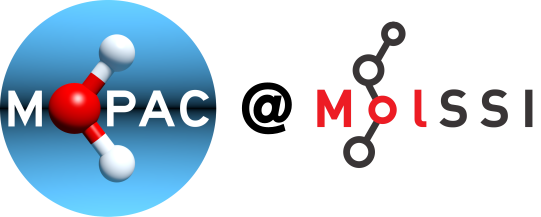

# Molecular Orbital PACkage (MOPAC)

[](https://opensource.org/licenses/Apache-2.0)
[](https://zenodo.org/badge/latestdoi/177640376)
[](https://anaconda.org/conda-forge/mopac)

[](https://codecov.io/gh/openmopac/mopac)

This is the official repository of the modern open-source version of MOPAC, which is now released under an Apache license
(versions 22.0.0 through 23.0.3 are available under an LGPL license).
This is a direct continuation of the commercial development and distribution of MOPAC, which ended at MOPAC 2016.
Commercial versions of MOPAC are no longer supported, and all MOPAC users are encouraged to switch to the most recent open-source version.

[](https://molssi.org)

MOPAC is actively maintained and curated by the [Molecular Sciences Software Institute (MolSSI)](https://molssi.org).

## Installation

Open-source MOPAC is available through multiple distributon channels, and it can also be compiled from source using CMake.
In addition to continuing the distribution of self-contained installers on the
[old commercial website](http://openmopac.net/Download_MOPAC_Executable_Step2.html) and here on GitHub,
MOPAC can also be installed using multiple package managers and accessed through containers.

### Self-contained installers

Self-contained graphical installers for Linux, Mac, and Windows are available on GitHub for each release,
which are constructed using the [Qt Installer Framework](https://doc.qt.io/qtinstallerframework/).

While the installers are meant to be run from a desktop environment by default, they can also be run from a command line without user input.
On Linux, the basic command-line installation syntax is:

`./mopac-x.y.z-linux.run install --accept-licenses --confirm-command --root type_installation_directory_here`

For more information on command-line installation, see the [Qt Installer Framework Documentation](https://doc.qt.io/qtinstallerframework/ifw-cli.html).

Linux installations without a desktop environment may not have the shared libraries required for the graphical installers,
and there have also been isolated reports of problems with the Qt installer on other platforms. A minimal, compressed-archive installer
is available for each platform as an alternative for users that have problems with the Qt installer.

The minimum glibc version required for the precompiled version of MOPAC on Linux is currently 2.17.

#### Library path issues

The pre-built MOPAC executables use the RPATH system on Mac and Linux to connect with its shared libraries,
including the `libiomp5` Intel OpenMP redistributable library. The `libiomp5` library is not properly versioned, and the recent version used by
MOPAC is not compatible with older versions that might also exist on a user's machine. If a directory containing an old version of `libiomp5`
is in the shared library path (`LD_LIBRARY_PATH` on Linux, `DYLD_LIBRARY_PATH` on Mac), this will override the RPATH system, link MOPAC to the
wrong library, and cause an error in MOPAC execution. On Mac, this can be fixed by switching the offending directories to the failsafe shared library
path, `DYLD_FALLBACK_LIBRARY_PATH`. On Linux, the use of `LD_LIBRARY_PATH` is generally discouraged for widespread use, and there is no simple
workaround available. The newer version of `libiomp5` is backwards compatible, so replacing the offending version with the version used by MOPAC
should preserve the functionality of other software that depends on the library.

### Package managers

The officially supported package manager for MOPAC is the [conda-forge channel of Conda](https://anaconda.org/conda-forge/mopac).
MOPAC is also packaged by major Linux distributions including
[Fedora](https://packages.fedoraproject.org/pkgs/mopac/mopac/) and
[Debian](https://tracker.debian.org/pkg/mopac).
It is also available in the [Google Play store](https://play.google.com/store/apps/details?id=cz.m).

[](https://repology.org/project/mopac/versions)

### Docker/Apptainer Containers

The official [Docker](https://www.docker.com) and [Apptainer](https://apptainer.org) ([Singularity](https://sylabs.io)) containers for MOPAC 22.0.6 ([Conda version](https://anaconda.org/conda-forge/mopac)) are developed and
maintained by [MolSSI Container Hub](https://molssi.github.io/molssi-hub/index.html) and are distributed by the MolSSI Docker Hub [repository](https://hub.docker.com/r/molssi/mopac220-mamba141).

### CMake

MOPAC is now built using a CMake 3.x build system with tests orchestrated using CTest.
The minimum required CMake version is presently 3.14.

CMake performs out-of-source builds, with the canonical sequence of commands:

```
mkdir build
cd build
cmake ..
make
```

starting from the root directory of the MOPAC repository. MOPAC should build without any additional options
if CMake successfully detects a Fortran compiler and BLAS/LAPACK libraries. Otherwise, the `cmake ..` command
may require additional command-line options to specify a Fortran compiler (`-DCMAKE_Fortran_COMPILER=...`)
or the path (`-DMOPAC_LINK_PATH=...`) and linker options (`-DMOPAC_LINK=...`) to link BLAS and LAPACK libraries to the MOPAC executable.

The CTest-based testing requires an installation of Python 3.x and Numpy that can be detected by CMake.

## Documentation

The main source for MOPAC documentation is presently its old [online user manual](http://openmopac.net/manual/index.html).

There is a [new documentation website](https://openmopac.github.io) under development, but it is not yet ready for general use.

## Interfaces

While MOPAC is primarily a self-contained command-line program whose behavior is specified by an input file, it also has other modes of
operation, some of which only require the MOPAC shared library and not the executable. Note that API calls to the MOPAC library are not
thread safe. Each thread must load its own instance of the MOPAC library, such as by running independent calling programs.

### MDI Engine

MOPAC can be compiled to run as an MDI Engine through the [MolSSI Driver Interface Library](https://github.com/MolSSI-MDI/MDI_Library)
by setting `-DMDI=ON` when running CMake. See [MDI documentation](https://molssi-mdi.github.io/MDI_Library) for more information.

### Run from library

MOPAC calculations can be run as a C-like library call to `run_mopac_from_input(path_to_file)` where `path_to_file` is a C string
containing the system path to a MOPAC input file. Alternatively, a Fortran wrapper in the `include` directory allows this to be run as
the subroutine `run_mopac_from_input_f(path_to_file)` in the `mopac_api_f` module where `path_to_file` is a Fortran string.

### Diskless/stateless API

A subset of MOPAC calculations can be run through a C-like Application Programming Interface (API) defined by the `mopac.h` C header file
in the `include` directory, which also has a Fortran wrapper for convenience to Fortran software developers. Calculations run through this API
do not use any input or output files or any other form of disk access, and the data structures of the API contain all relevant information
regarding the input and output of the MOPAC calculation. The functionality and data exposed by this API is limited and has been designed to
align with the most common observed uses of MOPAC. Future expansion of this functionality and data will be considered upon request.

## Citation

To cite the use of open-source MOPAC in scientific publications, see the `CITATION.cff` file in this repository.
